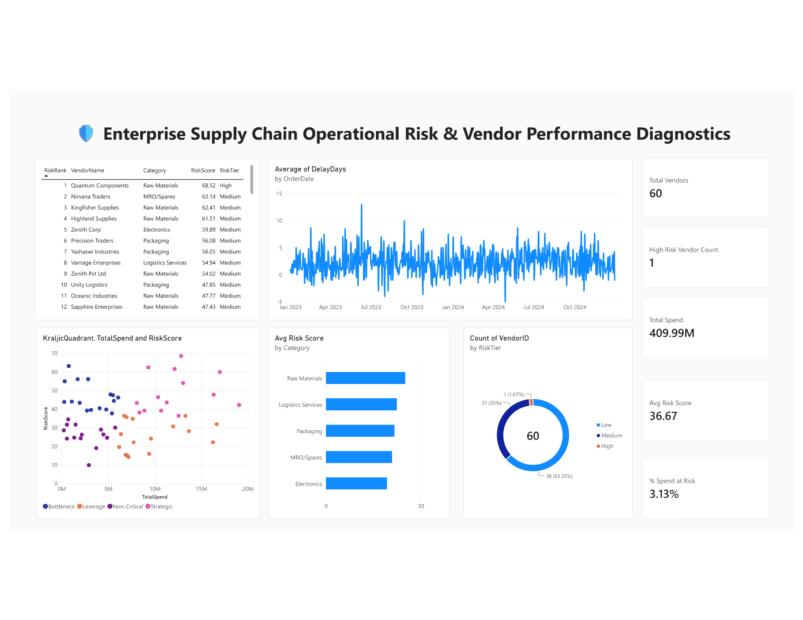
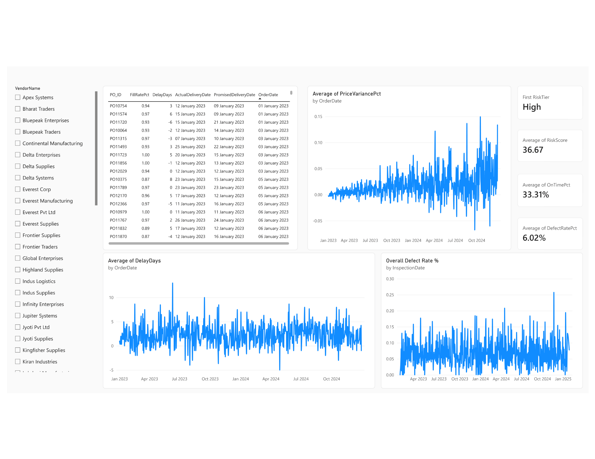

# 📊 Vendor Risk Scoring & BI Diagnostics

A validated, multi-factor vendor risk-scoring model and analytics framework built on a
simulated procurement dataset consisting of 60 unique suppliers and over 3,000
purchase orders (₹40.99 crore total spend).

## 🖥️ Dashboard Preview

## 🎯 The Business Problem

Procurement managers often lack data-driven clarity on vendor failure points until
bottlenecks hit factory floors. This project transforms raw purchase history into
clear, defensible **current-state risk tiers** and a **Kraljic Matrix supplier
segmentation**, isolating systemic supply chain vulnerabilities and quantifying
their business cost before they escalate into production halts.

## 🛠️ Tech Stack & Methods

- **Core Modeling:** Microsoft Excel (`AVERAGEIFS`, `SUMIFS`, `INDEX/MATCH`, and
  automated data integrity validation checks).
- **Business Intelligence:** Microsoft Power BI (star-schema data architecture,
  custom DAX measures, vendor-level drill-down pages).

## 📐 Methodology

Each vendor gets a **composite Risk Score (0–100)** built from four min-max
normalized sub-scores:

| Factor | Weight | Signal |
|---|---|---|
| Delivery reliability | 35% | On-time delivery rate |
| Quality | 30% | Defect rate |
| Price consistency | 20% | Price variance vs. contract |
| Fulfillment | 15% | Fill rate (ordered vs. delivered qty) |

Vendors are also segmented using a **Kraljic Matrix** (Supply Risk × Total Spend):

| Quadrant | Definition | Action |
|---|---|---|
| Strategic | High risk + High spend | Manage closely, dual-source |
| Bottleneck | High risk + Low spend | Secure alternative suppliers |
| Leverage | Low risk + High spend | Negotiate on price |
| Non-Critical | Low risk + Low spend | Simplify procurement |

## 🧠 Validated Architecture & Insights

- **Validation run:** 6 deliberately-planted problem vendors were seeded into the
  source data to test the model. The scoring formulas correctly surfaced **4 of the
  6** inside the top 8 highest-risk slots of 60 — evidence the approach works, while
  showing no single score catches everything.
- **Key domain insight:** Operational risk does not cluster cleanly by product
  category — it's a vendor-level property, not something a blanket "avoid category X"
  policy can fix.
- **Business impact quantification:** ₹1.28 crore (3.13%) of total procurement spend
  sits with the single High-risk vendor — turning an abstract score into a concrete
  dollar-exposure figure.

## 📁 Files

- `Vendor_Risk_Raw_Data.xlsx` — the 4 source tables
- `Vendor_Risk_Analysis.xlsx` — full workbook: row-level metrics, data quality checks,
  risk scoring, Kraljic segmentation, executive KPI summary
- `Vendor_Risk_Dashboard.pbix` — the Power BI report (2 pages)
- `screenshots/` — dashboard preview images

## ⚠️ Limitations & Assumptions

- All data is synthetic — realistically structured, but not a real company's actual
  vendors.
- The rule-based weights (35/30/20/15) are a reasonable, defensible starting point
  but would need validation against real business outcomes in production.
- Min-max normalization is sensitive to outliers with a small vendor set — a
  percentile-rank approach would be a reasonable alternative to test.

---

## 🔗 Related Project

See also: **[Vendor Risk & Supply Chain Diagnostics](https://github.com/arvind-yadav-vit/vendor-risk-supply-chain-diagnostics)**
— the same operational risk problem, solved with Python, a leakage-safe predictive
ML model (Logistic Regression + Random Forest), and a Streamlit dashboard. This
repo (Excel/Power BI) focuses on a transparent, auditable business scorecard;
that one adds a forward-looking predictive layer.

---

**Developed by Arvind Yadav** — connect with me for Data Analyst or related roles.
